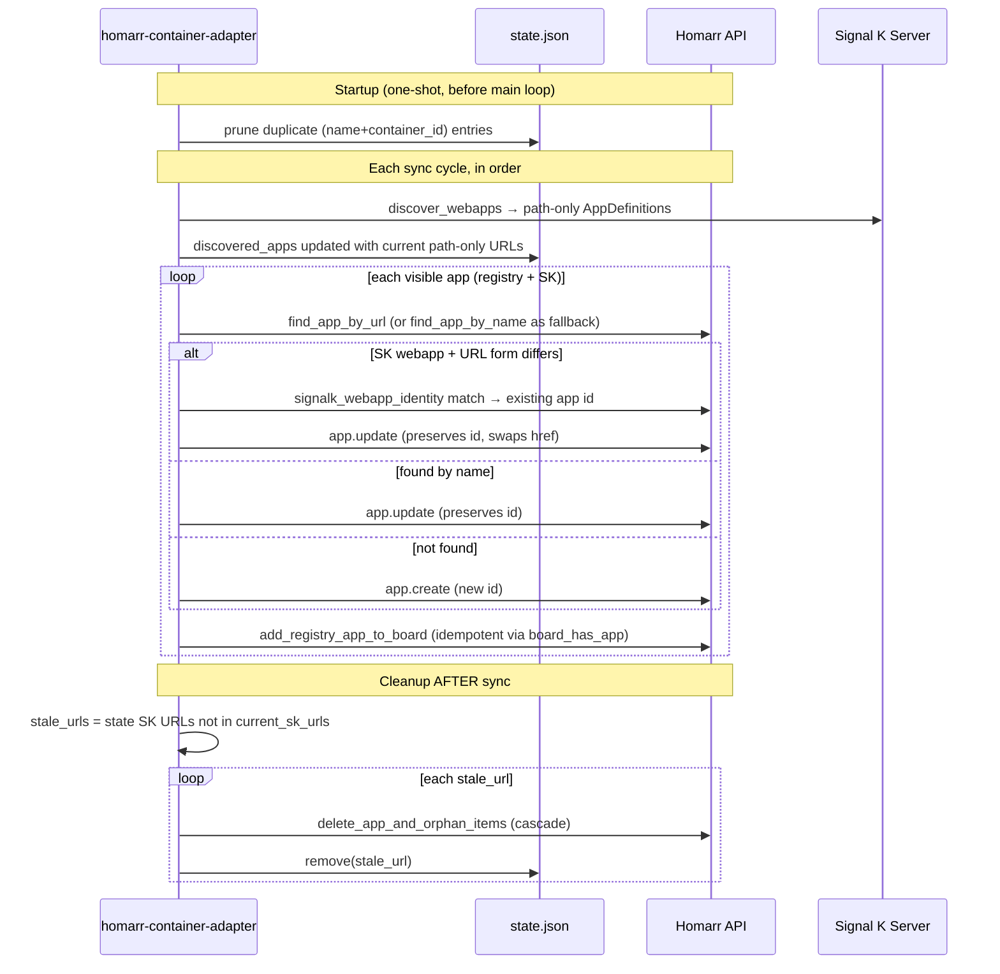

# Fix orphan SK-webapp board items left by absolute→path-only URL migration

**Target repo:** `homarr-container-adapter` (paths in this plan are repo-relative within that repo unless otherwise noted).

## Overview

Commit `6482467 feat(adapter): accept and emit path-only URLs` (April 30 2026) introduced a regression: when the adapter runs against a Homarr DB previously synced under absolute URLs, it deletes the existing SK-webapp app rows and re-creates them under new IDs, leaving the prior board items pointing at the deleted appIds. Each leftover board item renders as a "No app" placeholder alongside the working path-only-URL card for the same webapp.

The bug-introducing version was never released through APT, so the fix is forward-looking only:
1. Stop creating orphans on URL-format transitions (re-order sync vs. cleanup; teach SK identity comparison to span URL forms).
2. Cascade-remove board items whenever an app is deleted, as a general safety net.
3. Prune legacy duplicate entries in state.json on adapter startup.

## Problem Frame

Five contributing factors interact to create the orphan items. The reproduction signature in a live DB is `item` rows whose `options.json.appId` is not present in the `app` table, exactly one orphan per SK webapp the device synced before commit `6482467` shipped.

The cause chain on first sync after the path-only migration deployed:

1. `src/homarr.rs` `normalize_url` is built on `url::Url::parse`, which fails for path-only inputs and returns the input unchanged. So `normalize_url("/signalk-server/foo/")` ≠ `normalize_url("https://<host>/signalk-server/foo/")`. URL identity does not span the absolute→path-only transition.
2. `src/main.rs` runs the SK-stale cleanup **before** sync. It iterates `state.discovered_apps` (still holding old absolute URLs), classifies each as stale (because `current_sk_urls` now holds path-only forms and #1 prevents cross-format match), looks up the corresponding app in Homarr by URL match (which succeeds at this moment because app rows still have absolute hrefs), and calls `client.delete_app(existing.id)`.
3. `src/homarr.rs` `delete_app` only POSTs `app.delete` — does not iterate boards or remove items pointing at the deleted appId. Homarr's `app.delete` itself does not cascade either.
4. Sync runs next: `add_registry_app` calls `find_app_by_url` (fails — same #1 bug) then `find_app_by_name` (fails — the app row was just deleted in step 2). Falls through to `app.create` with a new appId.
5. `add_registry_app_to_board` derives `item_id = format!("registry-{:x}", string_hash(&app.url))`. The new path-only URL hashes to a new item_id, `board_has_app(items, NEW_app_id)` returns false (the existing orphan item points at the deleted OLD_app_id), so a new item is appended next to the orphan.

Static-registry apps (Cockpit, AvNav, etc.) survive the same `normalize_url` bug because they're not subject to the SK-stale cleanup pass. Their old app row is never deleted, `find_app_by_name` matches and updates in place, and their stable container-name-based item_id keeps the existing item correctly pointed.

## Requirements Trace

- R1. After this fix lands, devices upgrading from any pre-`6482467` adapter to a post-fix adapter never grow orphan items.
- R2. New SK webapp installations and removals continue to work: a webapp added via the SK admin UI appears on the dashboard within a sync cycle; a webapp uninstalled from SK is removed from the dashboard within a sync cycle.
- R3. Future URL-format transitions for SK webapps (e.g., a hypothetical `/signalk-server/` rename) do not create orphan items.
- R4. Any future call to `delete_app` — for any reason, not only stale-SK-cleanup — does not leave board items pointing at the deleted app.
- R5. The fix is safe to ship via the adapter's normal APT publishing pipeline.
- R6. State.json no longer accumulates "absolute-URL alongside path-only-URL" duplicates for the same logical app.

## Scope Boundaries

- Out of scope: changes to Homarr itself. The fork already accepts path-only hrefs (and shipped to production today via halos-org/halos-core-containers#127). If `app.delete` in Homarr ever grows native cascade behavior, the adapter-side cascade in this plan becomes redundant — but that's not on the immediate horizon and the adapter-side fix is correct independently.
- Out of scope: changes to the static webapp registry. Static-registry apps are not affected by this bug.
- Out of scope: changes to Signal K Server.
- Out of scope: a generic "URL format transition" framework. The fix in this plan is targeted at the absolute→path-only case via the SK-identity helper plus the general delete-cascade safety net. A broader scheme is not justified at this volume.

## Context & Research

### Relevant Code and Patterns

- `src/homarr.rs::normalize_url` (around line 211) — the parse-and-canonicalize helper that fails closed on path-only inputs. Has unit tests in the same file (search for `test_normalize_url_*`).
- `src/homarr.rs::find_app_by_url` (around line 784) and `find_app_by_name` (around line 798) — the dedup-on-add helpers used by `add_registry_app`. Name fallback already exists; URL identity is the broken half.
- `src/homarr.rs::add_registry_app` (around line 813) — main create-or-update entry point. The path-only commit didn't change its dedup logic, only the URLs flowing through it.
- `src/homarr.rs::delete_app` (around line 953) — currently posts `app.delete` only. Needs a cascade-remove-board-items wrapper or augmentation.
- `src/homarr.rs::add_registry_app_to_board` (around line 977) — generates `registry-{:x}` item_ids from URL hashes for non-container apps; the pure cause of "URL changes → item_id changes → board_has_app misses → orphan + duplicate".
- `src/main.rs` SK-stale-cleanup (around lines 178-220) — the order-of-operations site. Currently runs before sync; should run after.
- `src/signalk.rs::is_signalk_webapp_url` (around line 28) — already accepts both absolute and path-only forms (uses `split(SIGNALK_PATH_PREFIX)`); exposes the path identity that the fix can build on.
- `src/state.rs` — state.json shape, including `discovered_apps: HashMap<String, DiscoveredApp>`. Hand-rolled (de)serialization concerns live here.
- `src/registry.rs::is_path_only` (introduced by commit `6482467`) — already a shared path-only-vs-absolute predicate the fix can reuse without duplicating logic.
- `src/homarr.rs::get_all_apps`, `get_board_items`, `get_board_by_name`, `add_registry_app_to_board` — together provide the read/write surface for an "app deletion + item sweep" cascade.

### Institutional Learnings

- `docs/solutions/best-practices/2026-04-30-skip-apt-depends-pins-sibling-halos-packages.md` (in the workspace, not this repo) — same plan family. Reinforces that this fix must remain backward-compatible with cohort-upgrade timing: a device upgrading the adapter without simultaneously upgrading Homarr (or vice versa) must not break.
- Workspace `docs/solutions/best-practices/2026-05-04-verify-plan-against-repo-state-before-execution.md` — pre-execution verification block applies here too: before Unit 1, run a fresh `git log` / `grep` against the named files to confirm line numbers haven't drifted.

### External References

None warranted. The bug is fully traced in local code; no framework-version-specific behavior is involved.

## Key Technical Decisions

- **Decision A — identity-comparison fix location**: introduce a focused `signalk_webapp_identity(url) -> Option<String>` helper in `src/signalk.rs` that returns the canonical path identity (e.g., `/@signalk/freeboard-sk/`) when the URL looks like a SK webapp, regardless of host or scheme. Use this helper at the SK-cleanup decision site and at `find_app_by_url`'s SK fallback. Do **not** widen `normalize_url` to handle path-only — `normalize_url` is general-purpose, and a global change has too much blast radius (every other caller has to be re-analyzed). The narrow helper is exactly the abstraction this bug calls for.
  - Rationale: `is_signalk_webapp_url` already exists and demonstrates the pattern (split on `/signalk-server`, take the rest). A sibling `signalk_webapp_identity` returns the path identity rather than just a boolean. The two non-SK call sites of `normalize_url` (static-registry URL match in `find_app_by_url`, and the cleanup loop) keep their current absolute-URL-only semantics; only the SK-aware paths layer the new helper on top.

- **Decision B — delete-cascade location**: introduce a higher-level `delete_app_and_orphan_items(app_id, board_name)` (or per-board iteration) in `src/homarr.rs` that performs the cascade — fetch board items, drop items whose `options.json.appId` matches, write back via `board.saveBoard`. Update the SK-cleanup call site in `src/main.rs` to use the new method. Keep the bare `delete_app` available for tests / future callers but funnel production calls through the cascade wrapper. Don't bake the cascade into `delete_app` itself, because the cascade requires a board scope (the board(s) to write back to) which `delete_app` doesn't currently take.
  - Rationale: cascading at the call-site wrapper keeps `delete_app` honest about what it does (deletes the global app, nothing more) and gives the cascade an explicit board parameter. A future caller that wants "delete app, leave items as-is" still has the option, but every current caller goes through the cascade.

- **Decision C — order of operations**: run SK-stale-cleanup **after** sync, not before. With sync first, `add_registry_app` updates each existing SK app row in place via the SK-identity URL match (Decision A) so appIds are preserved across the format transition. By the time cleanup runs, `current_sk_urls` and the live `app` table agree on URL form, and the only state.json entries that look stale are genuinely-removed webapps.
  - Rationale: the order swap is the structural fix. Decision A alone (identity helper at the cleanup decision site) would also break the bug, but order-after-sync is the more defensive posture: even if some future bug re-broke identity, sync-first preserves appIds and the cleanup pass finds nothing to delete.
  - Concern: cleanup-after-sync means a webapp that was uninstalled in SK still gets one extra sync attempt (which fails or no-ops since the discovery list no longer contains it — actually, the discovery list IS the source of truth for sync; the uninstalled webapp simply isn't in `signalk_apps`, so sync doesn't touch it; cleanup then handles deletion). The semantics are unchanged for genuinely-stale webapps; only the format-transition case is repaired.
  - Concern: SK unreachable still skips both sync and cleanup for SK apps (existing behavior; the new code preserves the `signalk_result.is_some()` guard).

- **Decision D — state.json housekeeping**: at startup, prune state.discovered_apps entries that look like duplicates of a current entry under a different URL form. Specifically: when two entries share the same `name` and `container_id`, keep the more recent one (`added_at` is the tiebreaker) and drop the older one. This preserves the "logical app identity" while collapsing absolute/path-only duplicates.
  - Rationale: the state.json cruft doesn't cause orphans (per investigation), but it makes future debugging harder and risks hiding the next URL-transition bug. A one-shot prune at adapter startup is cheap and contained.
  - Limitation: relies on `name` + `container_id` as composite identity. SK webapps have empty `container_id` and rely on `name` alone, which works because SK display names are stable. If a future webapp legitimately renames itself, the prune may keep the wrong entry — but in that case the next sync corrects state anyway. Acceptable risk for a one-shot housekeeping pass.

- **Decision E — test posture**: characterization-first for the order-of-operations change (Unit 4), since the failing scenario is well-described by the investigation evidence and a regression test is the strongest signal that the fix sticks. Pure unit tests for the new SK-identity helper and the cascade wrapper. No new integration test infra; build on existing patterns in `src/homarr.rs` test module.

## Open Questions

### Resolved During Planning

- Where to fix the identity gap? — Decision A: focused `signalk_webapp_identity` helper in `src/signalk.rs`; do not widen `normalize_url`.
- Where to fix the delete-cascade gap? — Decision B: new `delete_app_and_orphan_items` wrapper in `src/homarr.rs`; route current call sites through it; bare `delete_app` remains for tests.
- Should sync run before cleanup? — Decision C: yes, swap the order.
- State.json housekeeping? — Decision D: one-shot prune at adapter startup, name+container_id identity.
- Test posture? — Decision E: regression tests for the orphan-prevention behavior; unit tests for the identity helper; build on existing test conventions.

### Deferred to Implementation

- Exact name of the new identity helper (`signalk_webapp_identity` vs `signalk_path_identity` vs other) — bikeshed at code-review time, not blocking.
- Whether the state.json prune should also prune entries whose URL doesn't appear in any current sync's `discovered_apps` (i.e., truly stale) — this is a nice-to-have housekeeping, defer to implementation reading.
- The `string_hash`-based item_id generation at `add_registry_app_to_board` is the deeper structural cause of "URL changes → item_id changes". Two options for a future hardening pass: (i) hash a stable identity (name + container_id, like the static-registry path) instead of `&app.url`; (ii) explicitly refresh the item_id on URL change. **Not in this plan** — the fixes here break the orphan-creation chain without touching the hash function. Deferred for a separate plan if URL transitions become a recurring pattern.

## High-Level Technical Design

> *This illustrates the intended approach and is directional guidance for review, not implementation specification. The implementing agent should treat it as context, not code to reproduce.*

Mermaid sequence: a single sync cycle with the fix applied.

The pre-fix flow had the cleanup loop running before sync and used `delete_app` (no cascade), which is exactly the orphan-creation chain.

## Implementation Units

- [ ] **Unit 1: Add `signalk_webapp_identity` helper for cross-format SK URL matching**

**Goal:** A single function that returns the canonical SK-webapp path identity for both absolute and path-only URL forms, so the cleanup decision and the SK-aware `find_app_by_url` site can compare logical identity instead of byte-for-byte URL equality.

**Requirements:** R3 (future format transitions don't break)

**Dependencies:** None.

**Files:**
- Modify: `src/signalk.rs` (add the new helper next to `is_signalk_webapp_url`)
- Modify: `src/signalk.rs` (extend the existing test module — `mod tests` — with new test cases)

**Approach:**
- Function takes a `&str`, returns `Option<String>` (the canonical identity, or `None` if the URL doesn't look like a SK webapp).
- For absolute URLs: parse via `url::Url`, take the path, find the `/signalk-server/` prefix, return the suffix. For path-only URLs: split on `/signalk-server/`, take the second part.
- Identity is the canonical sub-path with leading slash and (per existing convention) trailing slash trimmed for matching purposes.
- Reject the bare `/signalk-server/` (the SK Server tile, not a webapp), per existing `is_signalk_webapp_url` semantics.

**Patterns to follow:**
- `src/signalk.rs::is_signalk_webapp_url` (the simpler boolean version of the same logic).
- `src/registry.rs::is_path_only` for the path-only predicate.

**Test scenarios:**
- Happy path: `signalk_webapp_identity("/signalk-server/@signalk/freeboard-sk/")` returns `Some("/@signalk/freeboard-sk")` (or whatever canonical form is chosen — same output for the absolute version).
- Happy path: `signalk_webapp_identity("https://<host>/signalk-server/@signalk/freeboard-sk/")` returns the same identity as the path-only form.
- Edge case: trailing-slash and no-trailing-slash forms produce the same identity.
- Edge case: `signalk_webapp_identity("https://<host>/signalk-server/")` returns `None` (SK Server tile, not a webapp).
- Edge case: `signalk_webapp_identity("/cockpit/")` returns `None` (non-SK URL).
- Edge case: `signalk_webapp_identity("https://<host>/grafana/")` returns `None`.
- Edge case: invalid URL string returns `None` rather than panicking.

**Verification:**
- Tests pass.
- Helper is exported (or accessible via `pub(crate)`) for use in `src/main.rs` and `src/homarr.rs`.

- [ ] **Unit 2: Add `delete_app_and_orphan_items` cascade in `src/homarr.rs`**

**Goal:** A higher-level wrapper that deletes a global app row and removes any board items pointing at that appId on a given board, so future stale-cleanup passes (and any other future caller) can't leave orphan items.

**Requirements:** R4 (future delete_app calls don't orphan items)

**Dependencies:** None for compile-time; integration with Unit 4 at call-site time.

**Files:**
- Modify: `src/homarr.rs` (add the new method on the Homarr client; keep the bare `delete_app` accessible for tests)
- Modify: `src/homarr.rs::tests` (extend the existing test module)

**Approach:**
- Method takes `app_id: &str` and `board_name: &str`. Fetches the board's items via `get_board_items`, filters out items whose `options.json.appId == app_id`, calls `app.delete` for the global row, and writes the filtered item set back via `board.saveBoard`.
- Order: delete the global app first, then update the board. (Reverse order — board update first, then app delete — would leave a half-cleaned state where the app still exists but no item references it; less correct semantically.)
- Log a single info-level line summarizing: `"Deleted app '{name}' (id: {id}) and {n} orphan board item(s) on board '{board_name}'"` for observability.
- Errors propagate via `Result<()>`; partial failure (app deleted, board save failed) is logged at warn and returned as `Err`. Note that the next call to this method (e.g., on a future sync where SK genuinely removes another webapp) will not re-trigger cleanup for the partially-failed one because the global app row is already gone. Accepted residual risk: partial-failure of a `delete_app_and_orphan_items` call is rare (transient board-write failures), and the cost of building an automatic re-reconcile is unjustified at this scale.

**Patterns to follow:**
- `src/homarr.rs::add_registry_app_to_board` for the read-modify-write-board pattern (`get_board_items` → modify Vec → `board.saveBoard`).
- Existing `delete_app` for the `app.delete` POST.

**Test scenarios:**
- Happy path: a board with one item pointing at app_id X; calling `delete_app_and_orphan_items(X, board)` results in `app.delete` POST sent, then `board.saveBoard` POST sent with X-pointing item filtered out.
- Edge case: a board with zero items pointing at app_id X; the function still calls `app.delete` but skips the `board.saveBoard` write (or writes the unchanged item list — either is acceptable, the choice is settled at code-review time).
- Edge case: a board with multiple items pointing at the same app_id (shouldn't happen but defensively handled); all of them are filtered out.
- Error path: `app.delete` returns 4xx/5xx → function returns `Err` and does not attempt the board write.
- Error path: `app.delete` succeeds, `board.saveBoard` fails → function returns `Err`. Caller logs at warn and continues. Recovery is out of scope for this plan.

**Verification:**
- Tests pass.
- New method available on the `HomarrClient` (or whatever the client struct is named).

- [ ] **Unit 3: Use the SK-identity helper at sync and cleanup decision sites**

**Goal:** Wire `signalk_webapp_identity` into the two places that need cross-format SK URL matching: (a) `find_app_by_url`'s SK fallback in `src/homarr.rs`, and (b) the stale-classification step in `src/main.rs`'s SK cleanup pass.

**Requirements:** R3 (future format transitions don't break), R6 (state.json doesn't accumulate duplicates)

**Dependencies:** Unit 1.

**Files:**
- Modify: `src/homarr.rs::find_app_by_url` — after the existing `normalize_url` equality check, add a SK-fallback that returns the matching app when both URLs share an SK identity per Unit 1's helper. The `find_app_by_name` fallback further down stays unchanged as a third tier.
- Modify: `src/main.rs` SK-cleanup loop — when computing `stale_urls`, treat a state URL as "still current" if it shares an SK identity with any URL in `current_sk_urls`. Same logic applies to the inner `find` over `apps` for deletion (use SK identity as a fallback when `normalize_url` equality fails).
- Modify: `src/homarr.rs::tests` and `src/main.rs::tests` (or wherever main's tests live; some adapter binaries put integration tests in `tests/`)

**Approach:**
- Three-tier match in `find_app_by_url`: (i) `normalize_url` equality → (ii) SK identity match → (iii) None. Tier (iii) hands off to `find_app_by_name` in the calling context (existing behavior).
- Stale-detection in cleanup: a state SK URL is stale only if **no** current SK URL shares its identity. Use a small set of identities derived from `current_sk_urls` and check membership.
- Same applies when matching state's stale URL to an existing app row for deletion: SK-identity match is the second tier, after `normalize_url`.

**Patterns to follow:**
- `src/homarr.rs::find_app_by_url`'s existing iter+find shape — the SK fallback should be another `or_else` chain element.
- `src/main.rs::is_signalk_webapp_url(url) && !current_sk_urls.contains(url.as_str())` — replace the contains-by-string with contains-by-identity.

**Test scenarios:**
- Happy path: existing app stored with `href = "https://host/signalk-server/freeboard-sk/"`, sync arrives with `app.url = "/signalk-server/freeboard-sk/"`. `find_app_by_url` returns the existing app; appId is preserved.
- Edge case: SK identity matches but URL paths differ in case (e.g., `Freeboard-SK` vs `freeboard-sk`) — define the case-sensitivity in Unit 1 and confirm here. Default: case-sensitive (SK package names are case-sensitive).
- Edge case: state holds an SK URL that's no longer in `current_sk_urls` and no longer matches any current SK identity → still classified as stale, cleanup proceeds.
- Edge case: state holds the SK Server tile URL (`https://host/signalk-server/`) — not a webapp per `is_signalk_webapp_url`, never enters this code path; existing handling unchanged.
- Integration: a sim of "first sync after URL-format transition" — pre-state has 5 absolute SK URLs in `discovered_apps`, current sync emits 5 path-only forms; the cleanup pass identifies zero stale URLs (all matched by identity); each `add_registry_app` updates the existing app in place via the SK-identity branch, preserving appId; no new items are appended.

**Verification:**
- Tests pass.
- A locally-driven scenario with mocked Homarr API exhibits zero `app.delete` calls during a format-transition sync (the central regression).

- [ ] **Unit 4: Re-order sync vs SK-stale-cleanup, route cleanup through `delete_app_and_orphan_items`**

**Goal:** Move the SK-stale-cleanup pass to run after sync, and route its `delete_app` call through the new cascade wrapper from Unit 2. Together with Unit 3's identity matching, this breaks the orphan-creation chain on URL-format transitions.

**Requirements:** R1, R2 (existing remove-webapp behavior preserved), R4

**Dependencies:** Unit 2, Unit 3.

**Files:**
- Modify: `src/main.rs` — restructure the sync function so the SK-cleanup loop runs after the per-app sync loop (i.e., after `add_registry_app` has run for all visible apps).
- Modify: `src/main.rs` — change the `client.delete_app(&existing.id)` call to `client.delete_app_and_orphan_items(&existing.id, &board.name)` (or per-board iteration if the wrapper takes one board at a time).

**Approach:**
- Lift the cleanup block from "before the per-app sync loop" to "after". The `signalk_result.is_some()` guard stays in place so SK-unreachable still skips both halves.
- Cleanup iterates `state.discovered_apps` keys and uses Unit 1's identity helper (via Unit 3's wiring) to decide stale-ness.
- Per-board iteration: cleanup also has to decide which board's items to clean. Either (i) pass the writable boards to cleanup and iterate, or (ii) inline cleanup inside the existing per-board loop after that board's sync. Implementation decides; the pattern that minimizes refactor and keeps cleanup atomic per (app, board) pair is preferred.

**Patterns to follow:**
- The existing `for board in &writable_boards` loop in `src/main.rs` for per-board scope.

**Test scenarios:**
- Regression / Integration: pre-fix scenario (5 SK webapps, format transition) — verify zero `app.delete` calls, zero new app creations, zero new items, all five SK-app rows updated in place. This is the central regression test.
- Happy path (genuine SK uninstall): one webapp removed in SK; current_sk_urls is missing it; state still has it; sync runs first (skips that webapp because not in `signalk_apps`); cleanup runs after, identifies it as stale, calls cascade wrapper, app and item both removed, state pruned.
- Edge case: SK unreachable → both sync and cleanup skip; no state mutation; matches existing behavior.
- Edge case: cascade wrapper returns `Err` for one webapp; cleanup logs warn and continues with the next stale URL. **Behavior change from current code:** the existing main.rs unconditionally calls `state.discovered_apps.remove(url)` regardless of delete success, which means a failed deletion drops the state entry and prevents retry on next sync. Unit 4 changes this to "only remove the state entry when the cascade returned `Ok`", so a failed deletion is retried on subsequent syncs. The behavior change is contained to this loop and improves recovery from transient failures; the test asserts the new behavior explicitly.
- Edge case: cleanup pass runs after a sync that itself failed for some webapps — those failures don't leak into cleanup decisions (cleanup operates on `current_sk_urls`, not on per-webapp sync success).

**Verification:**
- Tests pass.
- The per-app sync loop and the SK-stale-cleanup loop appear in that order in `src/main.rs`'s sync function.
- All `delete_app` call sites in `src/main.rs` go through `delete_app_and_orphan_items`.

- [ ] **Unit 5: One-shot state.json prune on adapter startup**

**Goal:** On adapter startup (before the main sync loop), collapse `state.discovered_apps` entries that share `name` + `container_id` to a single entry (keep the most recent by `added_at`). Repairs the cruft from the URL-format transition without affecting orphan-prevention logic.

**Requirements:** R6 (state.json housekeeping)

**Dependencies:** None.

**Files:**
- Modify: `src/state.rs` (add a `prune_duplicate_entries(&mut self)` method or similar; `State` is the persisted struct)
- Modify: `src/main.rs` (call the prune once at startup before entering the sync loop, after state load)
- Modify: `src/state.rs::tests` (or wherever state's tests live)

**Approach:**
- Group `discovered_apps` entries by `(name, container_id)` tuple; for each group with size > 1, keep the entry with the most recent `added_at` and drop the rest.
- Save state after pruning (use existing `save_state` / equivalent).
- Log at info level: `"State prune: collapsed {n} duplicate discovered_apps entries"` only when `n > 0`.

**Patterns to follow:**
- Existing methods on `State` for state mutation.
- Existing `save_state` invocation pattern (same as after a sync).

**Test scenarios:**
- Happy path: state with no duplicates → prune is a no-op, state unchanged.
- Happy path: state with two entries sharing `(name, container_id)` and different `added_at` → the older one is removed, only the newer survives.
- Edge case: three or more entries sharing the same identity → keep the newest, drop the rest.
- Edge case: SK webapps (empty `container_id`) — identity is just `name`; absolute and path-only versions of the same SK webapp are considered duplicates because both have `container_id = ""` and the same name.
- Edge case: empty `discovered_apps` → no-op.

**Verification:**
- Tests pass.
- A device that previously had 11 `discovered_apps` entries (per investigation: 6 path-only + 5 absolute non-SK duplicates) ends up with 6 after this prune runs once.

- [ ] **Unit 6: Adapter version bump and changelog entry**

**Goal:** Bump `homarr-container-adapter` from 0.4.6 to 0.4.7 (per workspace memory: package-affecting change requires a bump) and update the debian changelog via `bumpversion`.

**Requirements:** R5 (ships through APT)

**Dependencies:** Units 1-5 must be in their final shape (one VERSION bump per PR, not per commit, per workspace memory).

**Files:**
- Modify (via `bumpversion patch` on a clean tree): `VERSION`, `Cargo.toml`, `debian/changelog`, any other files registered with `bumpversion`.

**Approach:**
- Single `bumpversion patch` invocation at the end, after all code units land. Do not use `--allow-dirty`.
- If lefthook blocks the bumpversion commit due to a pre-existing hostname false positive (per workspace memory), use `LEFTHOOK=0 git commit` to complete.

**Patterns to follow:**
- Workspace memory: "One VERSION bump per PR, not per commit" — fold review iterations and re-bump once at the end.

**Test scenarios:**
- `Test expectation: none — pure release-management metadata change with no behavioral component.`

**Verification:**
- `VERSION` reads `0.4.7`.
- `debian/changelog` has a new entry with the expected version, RFC 2822 date, and a one-line summary.
- `Cargo.toml` package version matches.

## System-Wide Impact

- **Interaction graph:** `src/main.rs` sync function reorders sync ↔ cleanup; both call into `src/homarr.rs` client methods. New helpers in `src/signalk.rs` and `src/homarr.rs`. State.rs gets a startup prune. The container-discovery and registry-loader paths are untouched.
- **Error propagation:** the new cascade wrapper returns `Err` on partial failure (app deleted, board write failed); main.rs's existing log-and-continue pattern absorbs this without changing user-visible behavior. Accepted because the failure mode is rare (transient board-write failure) and the bug-introducing path is gone after Unit 4.
- **State lifecycle risks:** (i) `delete_app_and_orphan_items` may successfully delete the global app and fail the board write, leaving a residual orphan; the failure mode is rare and recovery is out of scope. (ii) State.json prune on startup runs before any sync; if the adapter crashes mid-prune (highly unlikely, single in-memory transformation + save), state is either pre-prune or post-prune, never partially pruned.
- **API surface parity:** the bare `delete_app` is no longer called from production code but stays available for tests and for any future caller that genuinely wants global-only deletion. The new wrapper is the production path.
- **Integration coverage:** Unit 4's regression test (format-transition zero-orphan invariant — pre-state 5 absolute SK URLs in `discovered_apps`, current sync emits 5 path-only forms, expected outcome zero `app.delete` calls and zero new app creations) is the load-bearing integration scenario. Unit-level mocks of the Homarr client cover the per-method behavior.
- **Unchanged invariants:** `find_app_by_name`, the static-registry sync path, container-name-derived item_ids (`registry-{container}`), the `is_signalk_webapp_url` semantic, and the `signalk_result.is_some()` guard for SK-unreachable. The plan does not alter the URL-hash-based item_id generation for non-container apps (deferred per Open Questions).

## Risks & Dependencies

| Risk | Mitigation |
|------|------------|
| Cascade wrapper introduces a per-delete board fetch + write, increasing API load. | Stale-cleanup is rare (runs only when state has SK URLs not in current discovery), and bounded by webapp count. Per-board cost is one fetch + one save per stale webapp. Acceptable. |
| Reordering sync vs cleanup changes timing semantics in subtle ways. | Decision C above explicitly walked the cases. Cleanup-after-sync is a strict superset of cleanup-before-sync's correctness for the stable case; the format-transition case strictly improves. |
| State.json prune drops the wrong duplicate when `name` is reused unexpectedly. | The duplicate-pruning identity is `name + container_id`; for non-SK apps both fields stay stable across URL changes, so the heuristic is exact. SK webapps have empty container_id, so identity is name-only — but SK webapp display names are stable (verified in `signalk.rs::discover_webapps`). One-shot, recoverable from next sync if wrong. |
| The bug fix lands but Homarr (the fork) regresses on `app.delete` cascade behavior in a future upstream release. | Adapter-side cascade is independent; does not depend on Homarr behavior. If Homarr ever adds native cascade, the adapter's wrapper becomes redundant but harmless. |
| Existing tests in `src/homarr.rs` and friends use line-number-based fixtures; adding new methods may shift line numbers and break unrelated tests. | Existing tests don't appear to assert on line numbers. Standard refactor practice applies. |
| `delete_app_and_orphan_items` is called in a loop over stale webapps; if one webapp's cascade fails, subsequent ones still run. Unit 4 changes `state.discovered_apps.remove` to be conditional on cascade success, so failed deletions are retried on subsequent syncs. | Documented in Unit 4 test scenarios. The behavior change is intentional: today's unconditional remove silently swallows transient failures and leaves orphaned global apps in Homarr; gating on success makes the loop self-healing across syncs. |

## Documentation / Operational Notes

- Update `homarr-container-adapter/AGENTS.md` if it documents the sync ↔ cleanup ordering (check during implementation; add a note if the doc claims a specific order).
- After landing, document the bug + fix in `docs/solutions/best-practices/` (workspace) — fits the bug-track in `ce:compound`'s schema. Record the URL-format-transition pattern as a class of bugs worth checking for in future migrations.
- The fix ships through the standard adapter APT pipeline (`halos-org/apt.halos.fi`). The state.json prune (Unit 5) runs automatically on the next adapter restart after upgrade.
- PR description should reference the merged production-promotion PR halos-org/halos-core-containers#127 as the upstream cause of the URL-format transition.

## Sources & References

- Adapter source: `src/main.rs`, `src/homarr.rs`, `src/signalk.rs`, `src/state.rs`, `src/registry.rs`
- Originating commit: `6482467 feat(adapter): accept and emit path-only URLs` (April 30 2026)
- Related plan in this repo: `docs/plans/2026-04-29-001-feat-homarr-path-only-card-urls-plan.md` (the plan that introduced path-only URLs adapter-side)
- Workspace plan that promoted the fork: `docs/plans/2026-05-04-001-feat-promote-homarr-fork-to-production-plan.md` (in `halos-org/halos`)
- Production-promotion PR: halos-org/halos-core-containers#127 (merged today)
- Reproduction: any device that ran the adapter under absolute SK URLs and was upgraded across commit `6482467`. The signature is `item` rows whose `options.json.appId` is missing from the `app` table on the device's Homarr DB at `/var/lib/container-apps/halos-core-containers/data/homarr/data/db/db.sqlite`.
